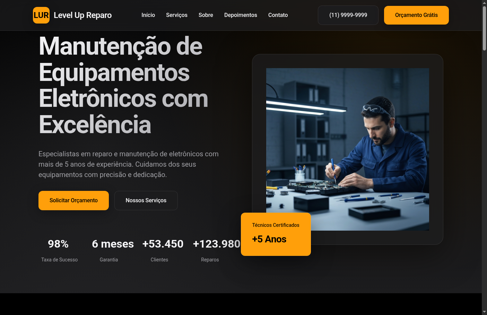
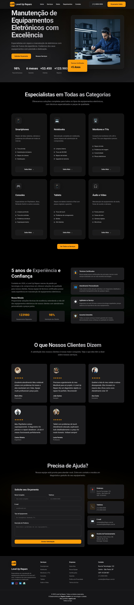

# Level Up Reparo (techfixpro)

## Visão Geral

Level Up Reparo é uma página web institucional desenvolvida para uma assistência técnica especializada em manutenção e reparo de equipamentos eletrônicos. O site apresenta uma identidade visual moderna, inspirada no design Apple, com foco em clareza, acessibilidade e experiência do usuário. O objetivo é transmitir confiança, profissionalismo e facilitar o contato entre clientes e a empresa.

## 🌐 Acesso ao Site

O site está disponível online através dos seguintes links:
<div id="badges">
  <a href="https://levelupreparo.netlify.app/">
    
    <p>Netlify</p>
  </a>
</div>
<div id="badges">
  <a href="https://rogeriocordeiro.github.io/levelupreparo">
    
    <p>GitHub Pages</p>
  </a>
</div> 

## 📸 Capturas de Tela

### Seção Principal (Hero)



### Página Completa



## Funcionalidades e Seções

O site é composto por diversas seções, cada uma cuidadosamente planejada para apresentar informações relevantes e facilitar a navegação:

- **Cabeçalho Fixo (Header):**

  - Logotipo e nome da empresa.
  - Menu de navegação responsivo com links para as principais seções.
  - Botões de contato rápido e orçamento.

- **Menu Mobile:**

  - Navegação adaptada para dispositivos móveis, com abertura e fechamento suave.

- **Seção Hero:**

  - Mensagem de impacto destacando a excelência e experiência da empresa.
  - Chamada para ação (CTA) para solicitar orçamento ou conhecer os serviços.
  - Estatísticas de sucesso, tempo de diagnóstico, garantia e número de clientes.
  - Imagem ilustrativa de técnico especializado.

- **Serviços:**

  - Cards detalhados para cada categoria de serviço (Smartphones, Notebooks, Monitores/TVs, Consoles, Tablets, Áudio e Vídeo).
  - Descrição dos serviços, lista de soluções e botão para saber mais.

- **Sobre:**

  - Breve história da empresa, missão e diferenciais.
  - Destaque para a experiência e certificação dos técnicos.

- **Depoimentos:**

  - Espaço para avaliações de clientes, reforçando a credibilidade e satisfação.

- **Contato:**

  - Formulário para solicitação de orçamento, com campos para nome, telefone, e-mail, equipamento e descrição do problema.
  - Informações de contato, endereço e canais de atendimento.

- **Rodapé (Footer):**
  - Informações institucionais, links úteis, redes sociais e créditos de desenvolvimento.

## Tecnologias Utilizadas

- **HTML5:** Estrutura semântica e acessível.
- **CSS3:**
  - Design moderno, responsivo e com efeitos de glassmorphism e gradientes.
  - Utilização de variáveis CSS para fácil manutenção de cores e temas.
- **JavaScript Vanilla:**
  - Interatividade do menu mobile, animações de entrada, rolagem suave e feedback do formulário de contato.

## Responsividade

O layout foi projetado para funcionar perfeitamente em dispositivos desktop, tablets e smartphones. O menu de navegação adapta-se ao tamanho da tela, garantindo uma experiência consistente e intuitiva em qualquer dispositivo.

## Estrutura de Pastas

```
├── index.html         # Página principal
├── style.css          # Estilos customizados
├── img/               # Imagens e ícones utilizados no site
├── README.md          # Documentação do projeto
```

## Como Utilizar

1. **Clone ou baixe o repositório:**
   - `git clone <url-do-repositorio>`
2. **Abra o arquivo `index.html` em seu navegador de preferência.**
3. **Personalize as informações:**
   - Altere textos, imagens e dados de contato conforme a necessidade da sua empresa.
4. **Hospedagem:**
   - O site pode ser hospedado em qualquer serviço de hospedagem estática (GitHub Pages, Vercel, Netlify, etc.).

## Personalização

- **Cores e Identidade Visual:**
  - As cores e gradientes podem ser facilmente alterados no início do arquivo `style.css`.
- **Imagens:**
  - Substitua as imagens da pasta `img/` para adequar ao perfil da sua equipe e serviços.
- **Conteúdo:**
  - Atualize os textos das seções diretamente no `index.html`.

## Boas Práticas Adotadas

- Código semântico e comentado.
- Separação clara entre estrutura (HTML), estilo (CSS) e comportamento (JavaScript).
- Foco em acessibilidade e performance.
- Design responsivo e adaptável.

## Créditos e Licença

Desenvolvido por Rogerio Cordeiro para fins acadêmicos e profissionais. Sinta-se à vontade para utilizar, modificar e distribuir este projeto, mantendo os devidos créditos ao autor.

---

Para dúvidas, sugestões ou colaborações, entre em contato pelo e-mail disponível no rodapé do site.
